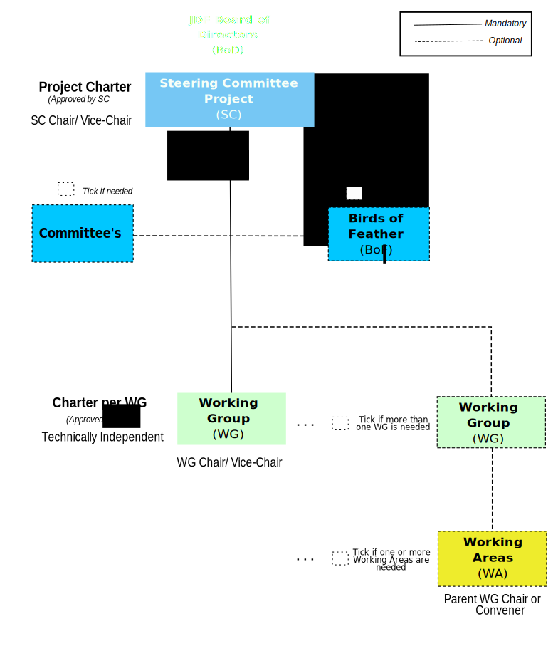

# Rules of Engagement
## Organization Structure

<figure>
	
	<figcaption>OMP Governance Structure</figcaption>
</figure>

## Technical Steering Committee

## Working Groups (WG)
* Working Groups (WGs) are [chartered]() by TSC to handle one or more work items.
* WGs MAY create Working Area Groups to address specific topics within their charter.

# The Way We Work
## Meetings
* WGs are encouraged to schedule regular conference calls.
* The Meetings MUST be announced at least 7 days in advance.
* All the Organization members are contractually bound to the IPR policy under terms of the Membership Application and these IPR Guidelines must be followed.
* Meetings SHALL have an IPR call where a reminder of the IPR policy and the duties and obligations of members is provided.
* More details on the IPR disclosure policy is documented in the Organization IPR Procedural Guidelines [XXXIPR].

## WG Officers
* In performing their tasks, officers SHALL maintain strict impartiality and act in the interest of the Organization.
* Chairs MAY limit the amount of time allocated to a particular agenda item or discussion point.
* Chairs SHALL, after a reasonable period of discussion time, use means to quickly reach a decision including (but not limited to):
 * a statement of the Chair’s view of group consensus, which shall be accepted by the group if there are no objections
 * assignment of action items to progress the issue in a short a time period as possible
 * invite single or few objectors to no longer sustain their objections
 * informal voting, see Informal voting.
 * formal voting, see Formal voting.
 * Chairs MAY require that new information be provided about an issue before earlier decisions can be reopened/revisited.
 * The work and progress of the group is appropriately communicated through regular status reports to the TSC.
 
 A list of the current tasks associated with the chairs responsibilities is to be found [TBD]().
 
 * The chair MAY delegate tasks to the vice-chair, including chairing the group as and when necessary.

### Elections of Officers

## Technicak Decision Making
As part of their responsibilities defined in [WG Officers](), officers need to ensure efficient and effective decision-making. The decision making process in WGs is intended to be as inclusive as possible. WGs shall attempt to use consensus to make decisions. If consensus cannot be reached, voting mechanisms may be used. 
* Formal notice SHALL be given for decision making, e.g.:
 * Inclusion of a document on an agenda, proposing a specific decision to be taken (e.g. Change|Pull Request)
 * Inclusion of an item directly in the agenda (e.g. proposed next meeting date)
 * Items proposed for approval via the group mailing list (e.g. agreement a document revision)
 * Inclusion of a document for decision in an electronic Review, Comment and Approval event
 * Inclusion of a document for decision in an e-vote event 
 > The above list is not exhaustive.
* There SHALL be no distinction in the decision-making merit of real-time or non-real-time meetings.

### Seeking Consensus
* Groups shall endeavour to reach consensus on all decisions. 
* Informal methods of reaching consensus are encouraged (e.g. a show of hands).
* Groups SHOULD attempt to ensure contributions relating to the same subject matter are considered together before being disposed. 
* However the chair SHALL ensure that progress is not delayed by unavailable contributions or participants.
* Agreement SHALL be sought in all forms of meeting.

#### Handling objections when seeking consensus
* Objections from a small minority SHOULD be minuted and the objecting delegates SHOULD be questioned if having their objections minuted is sufficient and they agree to not sustain their objections. 
  * If such agreements are secured, then there is consensus for approving the proposal. 
  * If such agreements are not secured, then the proposal is not agreed and further action SHALL be taken (e.g. the proposal is withdrawn, updated, or voted on). 
  * Members are discouraged from sustaining their objections when it is clear that they would be overruled by a vote were one to take place.
* In real-time meetings, consensus can be determined by receiving no sustained objections to a proposal. Efforts to immediately resolve or record objections can be taken to attempt to achieve consensus.
* Where attendance is sparse when viewed from normal participation levels, potentially controversial proposals SHOULD be made available to the broader membership. 
* The chair is responsible for ensuring such opportunity for participation in the decision making process. 
* Sparsely attended meetings SHOULD NOT be used to drive through proposals that would not have broad support.
* Following a decision-making meeting, a summary of decisions and document dispositions SHALL be published as soon as is practical. 
* This will be addressed if the meeting minutes are available in a timely fashion.
* When there is insufficient time for review in a real-time meeting, non-real-time consensus approaches SHOULD be considered.  
* In non-real time meetings consensus SHOULD be developed by using Review, Comment and Agreement periods, e.g.:
  * Using the group mailing list
  * using Review and Approval, also called Decision Making process
* Proposals SHALL be available for a given period.

### Using voting to achieve agreement 

<table>
  <caption>Summary overview of Voting Procedures</caption>
  <thead>
    <tr>
	    <th>Type of formal vote </th>
	    <th>Threshold for approvald</th>
    </tr>	      
  </thead>	    
  <tbody>
    <tr>
	<td>TSC vote on specification material intended to be ratified by the Board</td>
	<td>At least two thirds of those Full and Sponsor Members who cast a vote</td>	    
    </tr>
    <tr>
	<td>All other formal votes</td>
	<td>Greater than fifty percent (50%) of those who cast a vote</td>
    </tr>    
  </tbody>
</table>

#### Phrasing of Voting Questions
* The chair ensures that questions to be voted upon SHALL be phrased in a concise and unambiguous manner. 
* Questions SHOULD NOT be phrased as the “The group SHALL not do xyz”. Examples of appropriate questions are:
  * SHALL the group agree the Specification?
  * SHALL the liaison be approved?
  * SHALL the new Work Item be approved?
  * SHALL the existing Work Item be stopped?
  * If the issue is to choose between two options (i.e. A or B), an example of the appropriate question may be:
  * SHALL the group agree Option A or Option B?
* The option receiving the highest number of votes SHALL be the decision of the group.
* If the issue is to choose between three or more options, the group SHOULD use informal voting to reduce the number of options to two, and then use formal voting, if necessary.

### Voting on Technical Issues
This section provides a summary of the voting procedures defined in section [Using voting to achieve agreement]().

<table>
  <caption>Summary overview of Voting Procedures</caption>
  <thead>
    <tr>
	    <th>Procedure</th>
	    <th>For additional information see Section</th>
    </tr>	      
  </thead>	    
  <tbody>
    <tr>
	<td>Before voting, a clear definition of the issues SHALL be provided by the chair</td>
	<td>TBD</td>
    </tr>
    <tr>
  <td>Members eligible to vote, SHALL only be entitled to one vote each</td>
  <td>TBD</td>
    </tr>
    <tr>
  <td>Each member MAY cast its vote as often as it wishes, and the last vote it casts counts</td>
  <td>TBD</td>
    </tr>
    <tr>
	<td>Voting MAY be performed electronically.</td>
	<td>TBD</td>
    </tr>
    <tr>
	<td>Voting MAY be performed by show of hands and members announcing their vote verbally one by one, or paper ballots.</td>
	<td>TBD</td>
    </tr> 
    <tr>
	<td>The result of the vote SHALL be recorded in the meeting minutes</td>
	<td>TBD</td>
    </tr> 
    <tr>
	<td>Groups MAY use informal voting to reach consensus. If the Group is still unable to reach consensus, then a formal vote MAY be taken. </td>
	<td>TBD</td>
    </tr> 
    <tr>
	<td>Each member’s electronic vote SHALL be electronically acknowledged to confirm participation in the vote.</td>
	<td>TBD</td>
    </tr> 
    <tr>
	<td>The voting period for proposals voted in non-real-time SHALL be as defined in section TBD.</td>
	<td>TBD</td>
    </tr>      
  </tbody>
</table>

### Ratification of decisions and appeals

## Working with other organizations

## Work Flow
<figure>
	
	<figcaption>OMP GitHub Flow</figcaption>
</figure>

## Documentation
* [Charter]()
* [Dictionary]()

# Collaboration Tools

